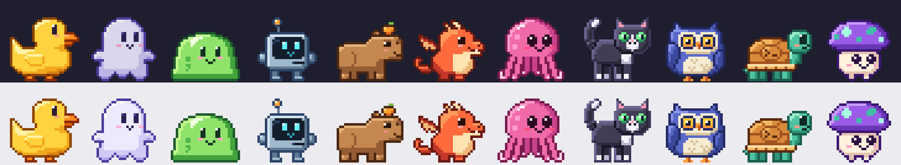

# Desktop Buddy

A tiny pixel-art pet that lives on your desktop. It naps on your taskbar, wanders around while you work (or only while you're away), hops onto your windows, begs for treats and judges your code — gently.



**Quackers** the rubber debug duck · **Boolean** the binary ghost · **Glorp** the semicolon slime · **Sprocket** the pocket robot · **Capybyte** the chill capybara · **Ember** the pocket dragon · **Callback** the async octopus · **Segfault** the chaos cat · **Owlgorithm** the night owl · **Shellby** the shell script turtle · **Spore** the glowcap mushroom

## Features

- **Hot-swap buddies** — each with its own animations, personality stats and things to say.
- **Move it or let it roam** — drag your buddy anywhere, or let it wander: always, or only while you're idle (then it walks back home when you return).
- **Light interactions** — click for a pat, feed it treats, toss it around, let it perch on the window you're using. Tamagotchi-lite hunger & happiness that's never punishing.
- **Stays out of the way** — transparent, click-through except the buddy itself, hides during fullscreen games and videos (per monitor), ghost mode for full pass-through.
- **Resizable & crisp** — integer pixel scaling at any DPI; Ctrl + scroll over the buddy to resize.
- **Command palette** — `Alt+Shift+B` from anywhere to search every action, buddy and setting.
- **Settings window** with search, light/dark themes and a buddy gallery. Tray icon and right-click menu for quick access.

Cross-platform (Tauri 2), tuned for Windows: taskbar-aware placement, perching on windows, fullscreen detection and topmost fixes use Win32 APIs and degrade gracefully elsewhere.

## Getting started

Prerequisites: [Node 24+](https://nodejs.org), [pnpm 10](https://pnpm.io), [Rust](https://rustup.rs) and the [Tauri prerequisites](https://tauri.app/start/prerequisites/) for your OS (on Windows: MSVC build tools + WebView2, which Windows 11 ships with).

```bash
pnpm install
pnpm dev        # run it
pnpm build      # installers in src-tauri/target/release/bundle
```

## Adding a buddy

Buddies are plain data: 32×32 text-grid frames, a palette and a personality. Create `src/pets/<id>.ts`, add it to `src/pets/index.ts`, then preview:

```bash
pnpm pets:preview <id>   # renders previews/<id>.png
pnpm test                # validates every buddy
```

See [`.claude/skills/add-buddy/SKILL.md`](.claude/skills/add-buddy/SKILL.md) for the full guide.

## Project layout & conventions

See [AGENTS.md](AGENTS.md) — it's written for AI coding agents but doubles as the contributor guide.
